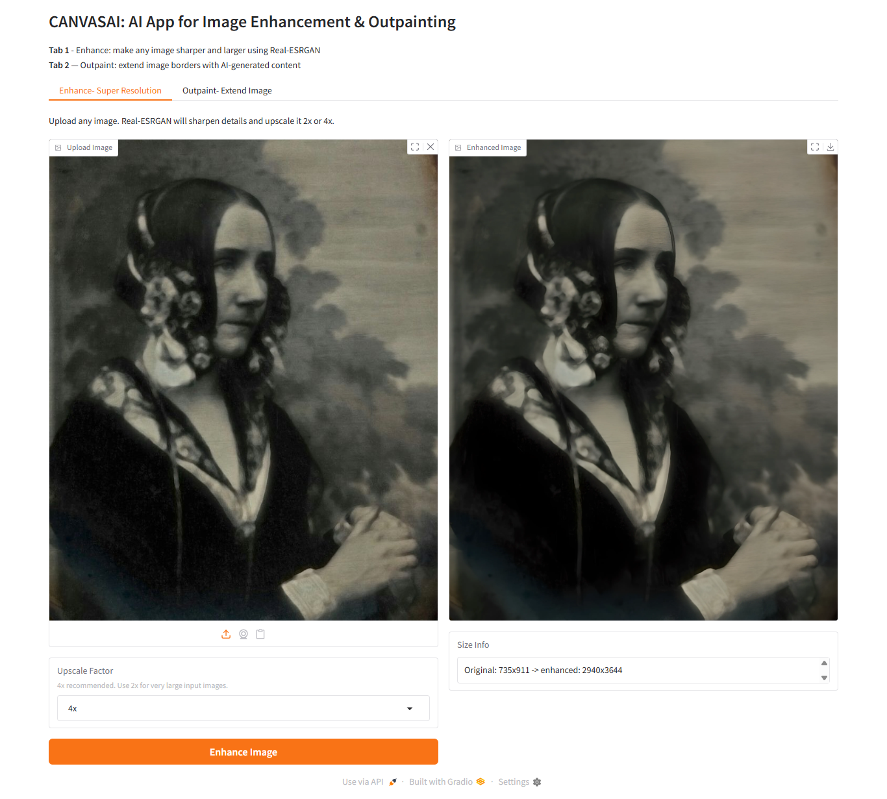
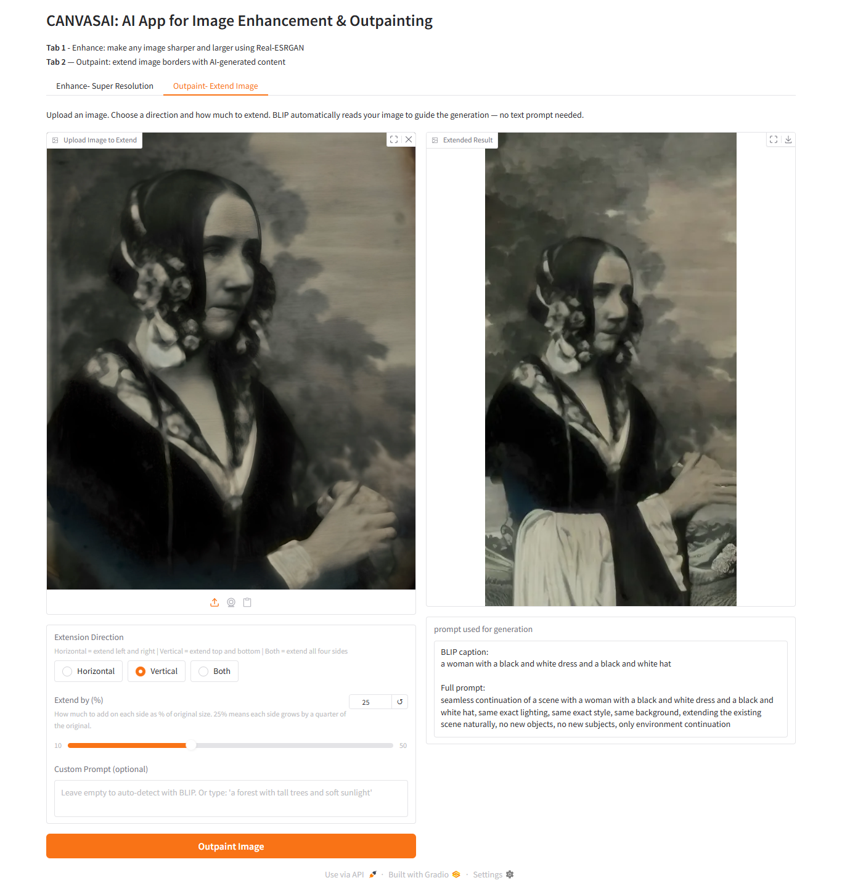

# CanvasAI

An AI-powered image enhancement and outpainting tool. Upload a photo, and CanvasAI either sharpens it to a higher resolution or extends its borders with coherent, AI-generated content that matches the original scene.

Built as a personal project to explore super-resolution models and diffusion-based inpainting — two techniques that are increasingly relevant in professional creative and media workflows.
## Kaggle Notebook

View and run the complete project on Kaggle:

🔗 [www.kaggle.com/CanvasAI-link](https://www.kaggle.com/code/mohiadiy/canvasai/edit)
---

## What it does

**Tab 1 — Enhance (Super Resolution)**  
Uploads a low-quality or small image and runs it through Real-ESRGAN to produce a sharper, larger version. Supports 2x and 4x upscaling. A 512×512 photo becomes a clean 2048×2048 with genuine detail recovery, not just interpolation.



**Tab 2 — Outpaint (Extend Image)**  
Extends the image canvas beyond its original borders in any direction — horizontally, vertically, or all four sides at once. The AI generates new content that matches the existing scene: same lighting, same color palette, same background. Uses BLIP to automatically read and describe the image so no manual prompt is needed.

 

The two features are intentionally separate. Enhancement makes images bigger and sharper. Outpainting makes images wider or taller with new content. They solve different problems.

---

## How it works

**Enhancement pipeline:**  
Real-ESRGAN uses a Residual-in-Residual Dense Block (RRDB) network trained on millions of image pairs to predict what high-frequency detail *should* be there in a blurry or compressed image. It processes the image in 512×512 tiles with overlap to prevent seams, then stitches them back together. The result is genuinely sharper than bicubic interpolation.

**Outpainting pipeline:**  
Most outpainting tools try to extend the entire border in one pass. The problem is that when you add a large empty region, Stable Diffusion has very little original image context to work with and starts hallucinating random content.

This tool takes a different approach — it extends the image in small steps of 64 pixels at a time, running SD inpainting on each step. Each pass only adds 64px of new content, which means SD sees roughly 88% original content and only 12% empty space to fill. With that much context, it understands the scene well and generates coherent continuations.

For a 25% extension on a 512px image, that comes out to about 4 passes per side.

BLIP automatically captions the image and that caption gets wrapped in scene-extension language: *"seamless continuation of a scene with [caption], same lighting, same background, same color palette"*. This guides SD to extend the environment rather than generate something entirely new.

The core mechanism behind seamless outpainting is the mask. SD inpainting uses a black-and-white image to decide what to generate:


White = generate new content here
Black = leave this alone, keep original


A hard black/white boundary produces a visible seam line. To fix this, the mask edge is blurred using ImageFilter.GaussianBlur(radius=30) after drawing the protection rectangle. This turns the hard edge into a soft gradient — grey values at the boundary tell SD to blend the generated content into the original rather than cutting sharply.

---

## Models used

| Model | Purpose | Size |
|---|---|---|
| `RealESRGAN_x4plus` | Super resolution (4x upscaling) | ~64 MB |
| `sd2-community-stable-diffusion-2-inpainting` | Outpainting via masked inpainting | ~5 GB |
| `Salesforce/blip-image-captioning-base` | Auto-prompt generation from image | ~900 MB |

All models download automatically. Real-ESRGAN weights are fetched directly from GitHub releases. The other two come from Hugging Face.

---

## Project structure

```
canvasai/
│
├── canvasai.ipynb      # Single Kaggle notebook — runs everything
└── README.md
```

Everything lives in one notebook. No separate frontend, no ngrok tunneling, no local server. Gradio's built-in `share=True` creates a public URL automatically.

---

## Setup and usage

### Requirements

- A free [Kaggle](https://kaggle.com) account
- GPU enabled in notebook settings (Accelerator → GPU T4 x2)

No local GPU needed. No API keys. No paid services.

### Running it

1. Open [kaggle.com](https://kaggle.com) and create a new notebook
2. In Settings (right sidebar), set Accelerator to **GPU T4 x2**
3. Copy the notebook cells in order and run them top to bottom
4. Cell 1 installs dependencies (~2 min)
5. Cell 2 downloads weights and loads all models (~4 min first run, faster after)
6. Cell 3 defines the enhancement function
7. Cell 4 defines the outpainting functions
8. Cell 5 builds the Gradio interface and launches it

When Cell 5 runs, it prints a public URL:
```
Running on public URL: https://randomstring.gradio.live
```

Open that URL in any browser. The interface stays alive as long as the cell is running. The URL is valid for 72 hours.

### First run vs subsequent runs

The first run downloads ~6GB of models. Kaggle caches these between sessions in `/kaggle/working`, so subsequent runs skip the download and load models into GPU memory in about 3-4 minutes.

---

## Usage tips

**For enhancement:**
- 4x works best on photos up to about 1000px on the long side
- 2x is faster and better for images that are already reasonably sharp

**For outpainting:**
- Start with a smaller extend percentage (15-20%) for more coherent results. Larger extensions ask the model to invent more, which increases inconsistency.
- The custom prompt field overrides BLIP. If BLIP captions your image poorly, type a simple scene description: "a cat sitting on a bamboo table in front of a green wall."
- "Horizontal" and "Vertical" run 2 passes each. "Both" runs 4 passes. Each pass takes ~20 seconds on a T4 GPU.
- Results vary run to run. SD is non-deterministic — if the first result doesn't match the scene well, try again.

---

## Known limitations

- Outpainting results are non-deterministic — same input, different result each run. This is how diffusion models work, not a bug.
- Complex scenes with people, faces, or strong perspective are harder to extend correctly. Simple backgrounds extend most cleanly.
- The Gradio public URL changes every session — no permanent URL on the free tier.
- Kaggle sessions expire after 12 hours. Reloading models takes 3-4 minutes.
- Very large input images may cause out-of-memory errors even with CPU offloading. If this happens, resize the input before uploading.

---

## What I learned building this

The most interesting part was understanding why sequential outpainting produces better results than extending all borders at once. When you mask all four borders simultaneously, the model generates large amounts of new content with only the center as context — it has no way to make the top extension consistent with the bottom because both are being generated at the same time. Sequential passes give each region the previous result as context, so decisions stay consistent across the whole image.

---

## Future Scope

- Persistent result saving — currently the extended image lives only in the Gradio session
- Multi-step preview — show the image updating after each pass instead of waiting for all passes to finish
- Aspect ratio presets (cinema 21:9, Instagram square, etc.) that auto-calculate the required extension
- LoRA support for consistent style extension (useful for illustrated/artistic images)
- Batch processing — run outpainting on multiple images in sequence
---

## Tech stack

Python · Gradio · Hugging Face Diffusers · Real-ESRGAN · BLIP · PyTorch · PIL · NumPy · Kaggle GPU

---

## Acknowledgements

- [Xintao Wang](https://github.com/xinntao) for Real-ESRGAN
- [Salesforce Research](https://github.com/salesforce/BLIP) for BLIP
- [Runway ML](https://runwayml.com) and [Stability AI](https://stability.ai) for the inpainting model
- [Hugging Face](https://huggingface.co) for Diffusers and model hosting
- [Kaggle](https://kaggle.com) for free GPU compute

---

## License

MIT. Use it, modify it, build on it.
