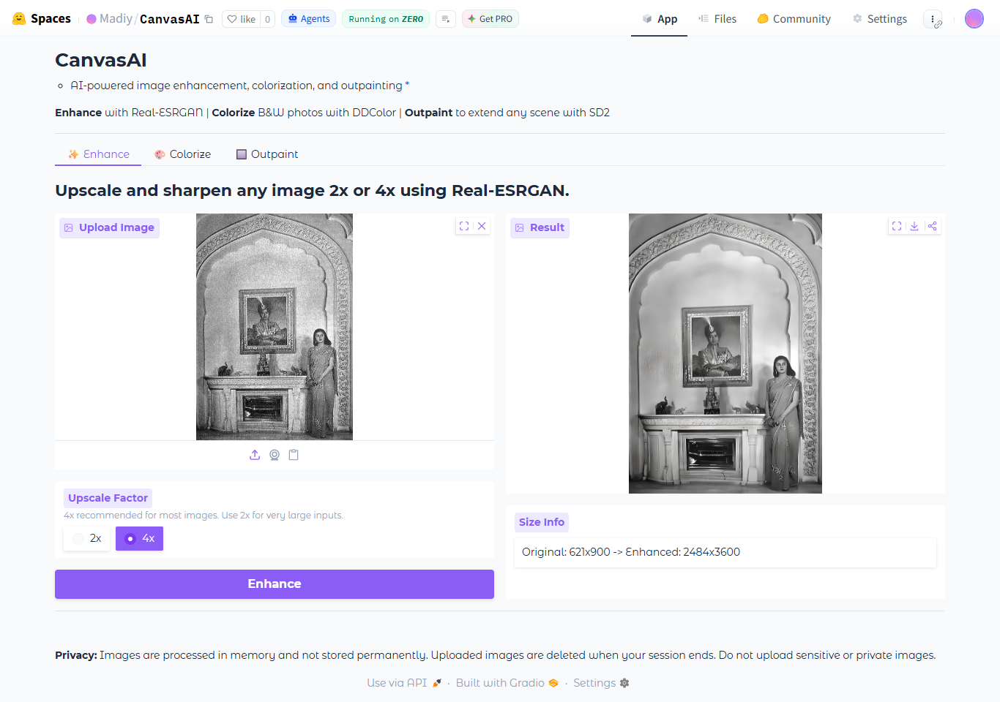
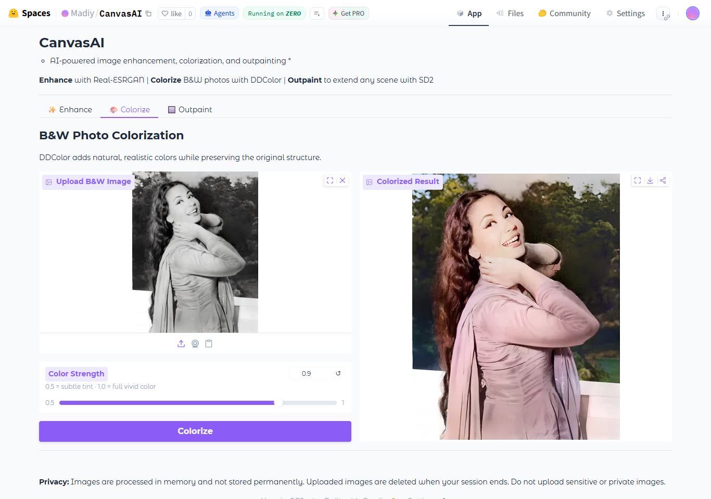
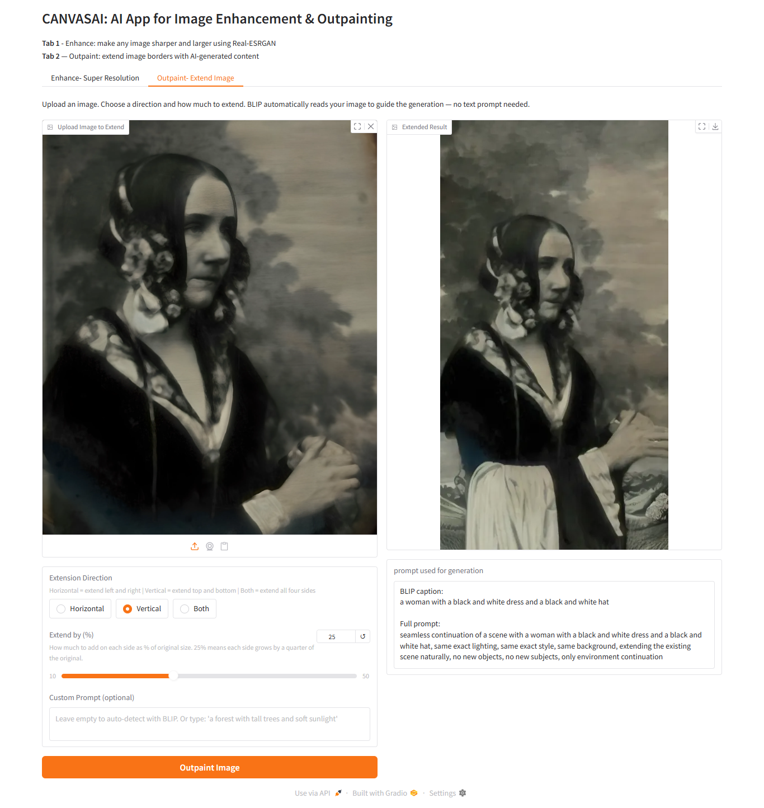

# CanvasAI

An AI-powered image tool with three capabilities: sharpen and upscale any photo, colorize black and white images automatically, and extend image borders with coherent AI-generated content that matches the original scene.

Built as a personal project to explore super-resolution models, diffusion-based inpainting, and dedicated colorization architectures — three techniques increasingly relevant in professional creative and media workflows.

## Live Demo → [huggingface.co/spaces/Madiy/CanvasAI](https://huggingface.co/spaces/Madiy/CanvasAI)

View and run the complete project on Kaggle:

🔗 [www.kaggle.com/code/mohiadiy/canvasai](https://www.kaggle.com/code/mohiadiy/canvasai/edit)

---

## What it does

**Tab 1 — Enhance (Super Resolution)**  
Upload any image and run it through Real-ESRGAN to produce a sharper, larger version. Supports 2× and 4× upscaling. A 512×512 photo becomes a clean 2048×2048 with genuine detail recovery — not just interpolation.



**Tab 2 — Colorize (B&W Photo Colorization)**  
Upload a black and white photograph and get a naturally colorized version. Uses DDColor — a model trained specifically for colorization, not general image generation. Works at the pixel level: predicts a plausible color for each pixel without altering structure or composition. Post-processed with LAB color space smoothing and saturation correction. No text prompt needed — fully automatic.


**Tab 3 — Outpaint (Extend Image)**  
Extends the image canvas beyond its original borders in any direction — horizontally, vertically, or all four sides. The AI generates new content that matches the existing scene: same lighting, same color palette, same background. BLIP automatically reads and describes the image so no manual prompt is needed.



The three features solve different problems. Enhancement makes images bigger and sharper. Colorization adds color to greyscale photos. Outpainting makes images wider or taller with new scene content.

---

## How it works

### Enhancement Pipeline

```
Upload image
      │
      ▼
Strip alpha channel (handles transparent PNGs)
      │
      ▼
Split into 512×512 tiles with 10px overlap
      │
      ▼
Real-ESRGAN processes each tile on GPU
(RRDB network reconstructs high-frequency detail)
      │
      ▼
Stitch tiles back together
(10px overlap prevents visible seam lines)
      │
      ▼
2× or 4× upscaled output
```

Real-ESRGAN uses a Residual-in-Residual Dense Block (RRDB) network trained on millions of image pairs to predict what high-frequency detail *should* be present. It processes images in 512×512 tiles with overlap to prevent VRAM overflow on large inputs, then stitches results together. The output is genuinely sharper than bicubic interpolation — detail is reconstructed, not just stretched.

---

### Colorization Pipeline

```
Upload B&W image
      │
      ▼
Convert to RGB, resize to 512px longest side
      │
      ▼
Convert PIL (RGB) → numpy (BGR) for DDColor
      │
      ▼
DDColor predicts color per pixel
(dedicated colorization model — structure unchanged)
      │
      ▼
Convert BGR → RGB
      │
      ▼
LAB color space smoothing
(smooth only A and B channels — L lightness untouched)
GaussianBlur(31×31) on color channels only
      │
      ▼
Saturation boost (1.4×) via PIL ImageEnhance
(compensates for DDColor's tendency to under-saturate)
      │
      ▼
Strength blend with original greyscale
(user-controlled via slider)
      │
      ▼
Resize back to original dimensions
```

The LAB color space smoothing step is the key post-processing improvement. By converting to LAB and smoothing only the A (green-red) and B (blue-yellow) channels with a 31×31 Gaussian kernel — while leaving the L (lightness) channel completely untouched — color consistency improves across similar regions without blurring structural edges. A 7×7 kernel is too small to produce a visible effect at 512px. 31×31 covers ~6% of the image width and produces clearly perceptible smoothing.

---

### Outpainting Pipeline

```
Upload image → resize to 512px longest side
      │
      ▼
BLIP reads image → generates scene caption automatically
Detect greyscale → adjust prompt style (B&W or color)
      │
      ▼
┌─────────────────────────────────────┐
│  Loop: 64px per pass                │
│                                     │
│  ┌─ Pad canvas with black border    │
│  │   on chosen side                 │
│  │                                  │
│  ├─ Draw protection mask            │
│  │   BLACK = keep original          │
│  │   WHITE = generate here          │
│  │                                  │
│  ├─ GaussianBlur(radius=30) on mask │
│  │   Hard edge → soft gradient      │
│  │                                  │
│  ├─ Resize to 768×768 (LANCZOS)     │
│  │   Preserves soft gradient        │
│  │   (NEAREST would destroy it)     │
│  │                                  │
│  ├─ SD2 Inpainting fills            │
│  │   the white masked region        │
│  │                                  │
│  └─ Result feeds next pass          │
│     as new input image              │
└─────────────────────────────────────┘
      │
      ▼
Final extended image
```

**Why 64px steps instead of one large pass:**

Most outpainting tools extend the full border at once. The problem is that when you add a large empty region, SD has very little original context to work with and generates inconsistent content.

```
Single large pass (200px on 512px image):
SD sees: [200px empty — 39% unknown] | [312px original — 61% context]
Result: SD guesses. Often incoherent.

Multi-pass (64px steps):
SD sees: [64px empty — 11% unknown] | [512px original — 89% context]
Result: SD extrapolates naturally from rich context.
```

For a 25% extension on a 512px image — 4 passes per side. Each pass builds on the previous result, so decisions stay consistent across the full extension.

**Why the mask resampling algorithm matters:**

The protection mask is blurred with GaussianBlur to create a soft gradient at the boundary. When this mask is resized from the actual canvas size to SD's 768×768 input size, the resampling algorithm determines whether the gradient survives:

```
NEAREST resampling: picks nearest pixel value without interpolating
→ hard black/white edges restored → gradient destroyed → visible seam

LANCZOS resampling: interpolates across neighboring pixels
→ soft gradient preserved → SD blends smoothly at boundary
```

This single choice — NEAREST vs LANCZOS for mask resizing — is the difference between visible seam lines and seamless blending.

---

## Models used

| Model | Purpose | Size |
|---|---|---|
| `RealESRGAN_x4plus` | Super resolution (2× or 4× upscaling) | ~64 MB |
| `damo/cv_ddcolor_image-colorization` | Dedicated B&W colorization | ~400 MB |
| `sd2-community/stable-diffusion-2-inpainting` | Outpainting via masked inpainting | ~5 GB |
| `Salesforce/blip-image-captioning-base` | Auto-prompt generation from image | ~900 MB |

All models download automatically on first run. Real-ESRGAN weights are fetched from GitHub releases. The others come from Hugging Face and Modelscope.

---

## Project structure

```
CanvasAI/
│
├── app.py                  # HF Spaces version — models, logic, Gradio UI
├── requirements.txt        # HF Spaces dependencies (no torch pin — ZeroGPU injects its own)
├── kaggle_notebook.ipynb   # Kaggle version — same logic, cell-by-cell structure
└── README.md
```

The entire application logic lives in `app.py`. No separate modules. Kept intentionally simple so the code is easy to follow and explain.

---

## Two ways to run

### Option 1 — Hugging Face Spaces (recommended)

Live at [huggingface.co/spaces/Madiy/CanvasAI](https://huggingface.co/spaces/Madiy/CanvasAI)

Runs on ZeroGPU (NVIDIA RTX Pro 6000 Blackwell). No local GPU needed. Just open the URL and use it.

### Option 2 — Kaggle Notebook

```
1. Open kaggle_notebook.ipynb on Kaggle
2. Set accelerator to GPU T4 x2 in settings
3. Run all cells
4. Gradio's share=True creates a public URL automatically
```

No ngrok, no separate server setup. Gradio handles the public URL internally.

### Option 3 — Run Locally

**Requirements:** Python 3.10+, NVIDIA GPU with 12GB+ VRAM (SD2 alone needs ~10GB)

```bash
git clone https://github.com/Mohit485/CanvasAI
cd CanvasAI
pip install -r requirements.txt
python app.py
```

On first run downloads: Real-ESRGAN weights (~64MB), SD2 inpainting (~5GB), BLIP (~900MB), DDColor (~400MB).

---

## ZeroGPU deployment notes

**No torch version pinned in requirements.txt.** ZeroGPU injects its own compatible PyTorch build. Pinning a specific version causes architecture mismatches when HF migrates GPU hardware (which they do without notice). Removing the torch pin and letting ZeroGPU manage it is the stable approach.

**Models move to CUDA at startup.** ZeroGPU uses a CUDA emulation mode that allows `.to("cuda")` at module load time. This is required — lazy-loading inside `@spaces.GPU` functions conflicts with ZeroGPU's resource allocation model.

**All SD inference passes run inside one GPU allocation.** The multi-pass outpainting loop runs inside the single `@spaces.GPU` decorated function, so the GPU stays allocated for the full outpainting job rather than being released and reacquired between passes.

---

## Usage tips

**For enhancement:**
- 4× works best on photos up to about 1000px on the long side
- 2× is faster and better for images that are already reasonably sharp
- Does not deblur — blurry input produces a larger blurry output

**For colorization:**
- Works best on portraits, outdoor scenes, and architectural photos
- Complex fabric patterns may colorize inconsistently — this is a DDColor limitation
- Use the strength slider at 0.9 (default) for vivid color; lower values give subtle tints
- Results will not match commercial colorization tools

**For outpainting:**
- Start with 15–25% extension for most coherent results
- Horizontal or Vertical direction produces better results than Both
- If BLIP misreads your image, use the custom prompt field: *"a forest path with tall oak trees and afternoon light"*
- SD is non-deterministic — if the first result is inconsistent, try again
- Each pass takes ~20 seconds on T4 GPU; Both direction at 25% = ~8 passes = ~3 minutes

---
 
## Known limitations

**Enhancement** does not deblur. Super resolution and deblurring are fundamentally different tasks requiring different models. Blurry input produces larger blurry output.

**Colorization** quality varies. Complex patterns (florals on fabric, textured clothing), unusual lighting, and heavily degraded vintage photographs may produce inconsistent or incorrect colors. The LAB smoothing post-processing reduces patchiness but does not eliminate DDColor's model-level limitations.

**Outpainting** quality is variable by design. The multi-pass architecture produces significantly better results than single-pass, but SD2 Inpainting was not purpose-built for boundary extension. Results are good on simple consistent backgrounds (sky, nature, open architecture) and unreliable on complex foreground subjects near the image edge or at extension percentages above 35%.

---

## What I learned building this

**LANCZOS vs NEAREST for mask resampling** is the most counterintuitive finding. GaussianBlur on a mask creates a soft gradient. Resizing that mask with NEAREST resampling destroys the gradient — it picks the nearest pixel value without interpolating, snapping everything back to hard black or white. LANCZOS interpolates and preserves the gradient. This single line change made the difference between visible seam lines and smooth blending.

**Kernel size matters for LAB smoothing.** A 7×7 GaussianBlur kernel on a 512px image covers 1.4% of the image width — the effect is mathematically real but visually invisible. A 31×31 kernel covers 6% and produces clearly perceptible color consistency improvement. The post-processing step appeared broken for a long time because the kernel was too small to see.

**Multi-pass context beats single-pass extension.** The math is simple: 64px of new content on a 512px image = 89% original context. 200px of new content = 61% context. SD needs context to generate coherently. The multi-pass architecture is a direct engineering response to this constraint.

**Tool selection over prompt engineering.** The original colorization approach used SD img2img, which generates new images inspired by the input rather than coloring the existing one. Switching to DDColor — a model built specifically for colorization — solved the fundamental problem that no amount of prompt engineering could address. Choosing the right model for the task is a more important skill than clever prompting.

**ZeroGPU infrastructure changes break working code.** HF migrated from H200 to Blackwell GPUs without notice. The torch binary compiled for the old architecture was incompatible with the new GPU. The fix was removing the pinned torch version entirely and letting ZeroGPU inject the correct build. Platform stability requires understanding the deployment environment, not just the application code.

---

## Future scope

- Deblurring pre-processing stage before Real-ESRGAN (NAFNet or OpenCV-based)
- Persistent result saving — currently the output lives only in the Gradio session
- Multi-step outpainting preview — show the image updating after each pass
- Aspect ratio presets (cinema 21:9, Instagram square) that auto-calculate extension amount
- Batch processing — run outpainting on multiple images in sequence

---

## Tech stack

```
Super Resolution     Real-ESRGAN (RRDBNet x4plus, tiled inference)
Colorization         DDColor (dedicated colorization model, Modelscope)
Inpainting           Stable Diffusion 2 (Hugging Face Diffusers)
Scene Understanding  BLIP (vision-language model, Salesforce)
Post-processing      LAB color space smoothing, PIL ImageEnhance (OpenCV + Pillow)
UI                   Gradio
Deployment           Hugging Face Spaces ZeroGPU
Language             Python
```

---

## Acknowledgements

- [Xintao Wang](https://github.com/xinntao) for Real-ESRGAN
- [DAMO Academy, Alibaba Group](https://github.com/piddnad/DDColor) for DDColor
- [Salesforce Research](https://github.com/salesforce/BLIP) for BLIP
- [Stability AI](https://stability.ai) for Stable Diffusion 2
- [Hugging Face](https://huggingface.co) for Diffusers, model hosting, and ZeroGPU
- [Kaggle](https://kaggle.com) for free GPU compute

---

## License

MIT. Use it, modify it, build on it.

---

## Privacy

Images are processed in memory and not stored permanently. Uploaded images are deleted when your session ends. Do not upload sensitive or private images.
