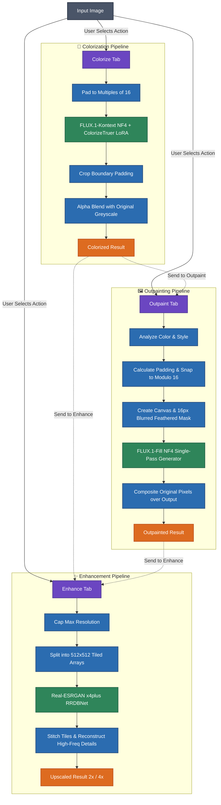

# CanvasAI 🎨

*An end-to-end, high-performance AI studio for restoring, colorizing, and expanding images using state-of-the-art quantized diffusion and super-resolution models.*

[](https://huggingface.co/spaces/Madiy/CanvasAI)
[](https://www.kaggle.com/code/mohiadiy/canvasai)
[](LICENSE)

---

## 📖 The Story Behind CanvasAI

Classic photos and modern digital captures often face three distinct technical hurdles: **low spatial resolution**, **lacking or faded color context**, and **restrictive framing dimensions**.

Most existing open-source solutions treat these tasks in isolation—forcing users to chain together multiple heavy notebooks or third-party web tools. **CanvasAI** was created to bridge this gap into a unified, lightweight workflow.

Instead of relying on heavy full-precision models that cause out-of-memory errors on free-tier compute, CanvasAI leverages a modern **NF4 quantized architecture** paired with **ZeroGPU dynamic acceleration**. The result is a seamless image manipulation engine that colorizes vintage photography, restores lost pixel clarity, and outpaints canvas boundaries—delivering high visual fidelity within seconds without hardware bottlenecks.

---

## 🔗 Live Interactive Demos

- **Hugging Face Spaces (ZeroGPU Accelerated)**: [Madiy/CanvasAI](https://huggingface.co/spaces/Madiy/CanvasAI)
- **Kaggle GPU Notebook**: [mohiadiy/canvasai](https://www.kaggle.com/code/mohiadiy/canvasai)

---

## 🛠️ Feature Breakdown

### 🎨 1. B&W Photo Colorization
Revitalize vintage black-and-white photography using **FLUX.1-Kontext** coupled with the fine-tuned **ColorizeTruer LoRA**. 
* **Precision Padding**: Automatically calculates target dimensions snapped to multiples of 16 to prevent internal pipeline center-cropping and distortion.
* **Strength Blending**: Features an adjustable alpha-blending slider that smoothly mixes predicted color back into the original greyscale luminance structure, preserving historical detail while adding natural warmth.

### 🖼️ 2. Single-Pass Outpainting Engine
Expand image boundaries horizontally, vertically, or symmetrically using **FLUX.1-Fill-dev NF4**.
* **Direct Single-Pass Generation**: Eliminates multi-pass edge artifacts by expanding the full target resolution in a single, coherent inference call.
* **Context-Aware Style Detection**: Analyzes scene saturation dynamically—automatically appending monochrome, sepia, or vivid photorealistic prompt directives to match incoming lighting.
* **Soft Boundary Feathering**: Applies a 16px Gaussian blurred protection mask to create smooth seam integration between existing original pixels and newly synthesized canvas extensions.

### ✨ 3. Super Resolution & Sharpening
Upscale low-resolution inputs by **2× or 4×** using **Real-ESRGAN (x4plus)**.
* Reconstructs sharp, high-frequency spatial details and textures using a Residual-in-Residual Dense Block (RRDBNet) architecture rather than simple pixel interpolation.
* Configured with tiling execution to eliminate GPU memory overhead on large canvas sizes.

---

## ⚙️ Architecture & Data Pipelines


```mermaid
graph TD
    %% Custom Styling
    classDef inputStyle fill:#4A5568,stroke:#2D3748,stroke-width:2px,color:#FFF;
    classDef tabStyle fill:#6B46C1,stroke:#553C9A,stroke-width:2px,color:#FFF;
    classDef procStyle fill:#2B6CB0,stroke:#2C5282,stroke-width:2px,color:#FFF;
    classDef modelStyle fill:#2F855A,stroke:#276749,stroke-width:2px,color:#FFF;
    classDef outStyle fill:#DD6B20,stroke:#C05621,stroke-width:2px,color:#FFF;

    InputImage[Input Image]:::inputStyle

    %% Routing
    InputImage -->|User Selects Action| ColorizeTab
    InputImage -->|User Selects Action| OutpaintTab
    InputImage -->|User Selects Action| EnhanceTab

    %% Colorize Subgraph
    subgraph Colorize_Pipeline ["🎨 Colorization Pipeline"]
        ColorizeTab[Colorize Tab]:::tabStyle --> Pad16_Col[Pad to Multiples of 16]:::procStyle
        Pad16_Col --> KontextModel[FLUX.1-Kontext NF4 + ColorizeTruer LoRA]:::modelStyle
        KontextModel --> Crop_Col[Crop Boundary Padding]:::procStyle
        Crop_Col --> Blend_Col[Alpha Blend with Original Greyscale]:::procStyle
        Blend_Col --> ColOutput[Colorized Result]:::outStyle
    end

    %% Outpaint Subgraph
    subgraph Outpaint_Pipeline ["🖼️ Outpainting Pipeline"]
        OutpaintTab[Outpaint Tab]:::tabStyle --> StyleAnalysis[Analyze Color & Style]:::procStyle
        StyleAnalysis --> GeometryPad[Calculate Padding & Snap to Modulo 16]:::procStyle
        GeometryPad --> MaskGen[Create Canvas & 16px Blurred Feathered Mask]:::procStyle
        MaskGen --> FluxFillModel[FLUX.1-Fill NF4 Single-Pass Generator]:::modelStyle
        FluxFillModel --> Composite_Out[Composite Original Pixels over Output]:::procStyle
        Composite_Out --> OutOutput[Outpainted Result]:::outStyle
    end

    %% Enhance Subgraph
    subgraph Enhance_Pipeline ["✨ Enhancement Pipeline"]
        EnhanceTab[Enhance Tab]:::tabStyle --> RescaleCap[Cap Max Resolution]:::procStyle
        RescaleCap --> TileSplit[Split into 512x512 Tiled Arrays]:::procStyle
        TileSplit --> ESRGANModel[Real-ESRGAN x4plus RRDBNet]:::modelStyle
        ESRGANModel --> TileStitch[Stitch Tiles & Reconstruct High-Freq Details]:::procStyle
        TileStitch --> EnhOutput[Upscaled Result 2x / 4x]:::outStyle
    end

    %% Inter-Tab Routing Flow
    ColOutput -.->|Send to Outpaint| OutpaintTab
    ColOutput -.->|Send to Enhance| EnhanceTab
    OutOutput -.->|Send to Enhance| EnhanceTab
```


---

## 🤖 Models & Quantization Stack

| Model Component | Model Identifier / Weights | Quantization / Precision | Role |
| :--- | :--- | :--- | :--- |
| **Outpainting Base** | `black-forest-labs/FLUX.1-Fill-dev` | `bfloat16` VAE / Text Encoders | Inpainting & boundary extrapolation |
| **Outpainting Transformer** | `sayakpaul/FLUX.1-Fill-dev-nf4` | **NF4 (4-bit NormalFloat)** | Low-VRAM Transformer execution |
| **Colorizer Backbone** | `aniketppanchal/flux.1-kontext-dev-nf4-pkg` | **NF4 (4-bit)** | Image-to-Image structural guidance |
| **Colorizer Adapter** | `AlekseyCalvin/ColorizeTruer_Merge5wRef_KontexFlux_LoRA_bySAP` | `bfloat16` LoRA | Palette & color distribution control |
| **Super-Resolution** | `RealESRGAN_x4plus` (RRDBNet) | `fp16` | 2×/4× Texture & spatial sharpening |
| **Quality Evaluation** | `openai/clip-vit-base-patch32` | `fp32` (CPU offloaded) | Text-image alignment scoring |

---

## 📂 Repository Structure
CanvasAI/
├── app.py              # HF Spaces deployment script (ZeroGPU + Gradio UI)
├── requirements.txt    # Production dependencies
├── weights/            # Local directory for cached Real-ESRGAN model binaries
└── README.md           # Project documentation

---

## 🚀 Getting Started & Local Installation

### Prerequisites
- Python 3.10+
- NVIDIA GPU with **12 GB+ VRAM** (with CUDA 11.8 / 12.0 support)

### Local Setup

1. **Clone the repository:**
   ```bash
   git clone [https://github.com/Mohit485/CanvasAI.git](https://github.com/Mohit485/CanvasAI.git)
   cd CanvasAI

2. **Create and activate a virtual environment::**
   ```bash
   python -m venv venv
   source venv/bin/activate

3. **Install dependencies:**
   ```bash
   pip install -r requirements.txt

4. **Run**
   ```bash
   python app.py


---

## 💡 Key Implementation Insights
- Strict CPU Offloading for Evaluation: To prevent VRAM allocation spikes during high-resolution inference, evaluation models like CLIPModel reside on system RAM by default and temporarily shift to GPU memory only when quality metric computation is explicitly toggled on.

- Modulo-16 Bounds Alignment: Modern VAE latent spaces downsample spatial inputs by a factor of 8 or 16. Ensuring all padded and expanded boundaries align to exact multiples of 16 prevents unexpected tensor cropping or spatial stretching.

- Seamless Dynamic Inter-Tab Routing: The Gradio user interface supports seamless tab-switching workflows. Users can colorize a black-and-white photo, immediately push the result to outpaint the background canvas, and finally send the composite to Real-ESRGAN for 4K upscaling without manually downloading intermediate files.


## 🛡️ License
This project is open-source and released under the MIT License.

## 🙏 Acknowledgements
- Black Forest Labs for the FLUX.1 model suite.

- Hugging Face for diffusers, model hosting, and ZeroGPU hardware support.

- Xintao Wang for the Real-ESRGAN architecture.

- Aleksey Calvin for the ColorizeTruer LoRA weights.
